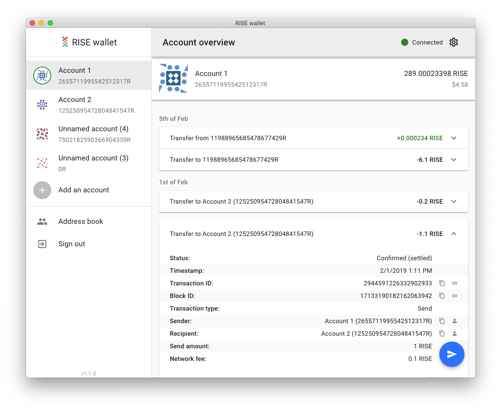
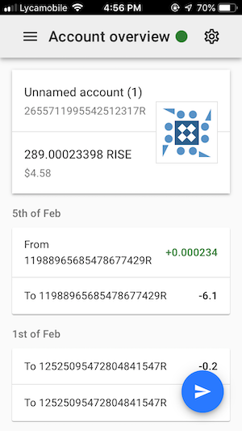
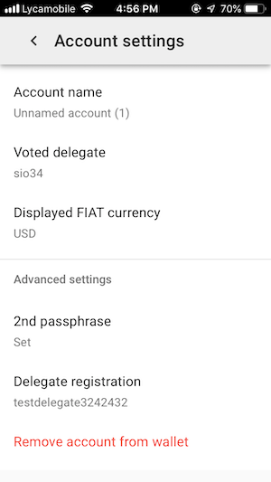

## RISE Wallet

RISE Wallet - web & desktop wallet for the **RISE** DPoS blockchain. Build using **TypeScript**, **React** and **Material UI**.

	

	
	

### Web access

- [mainnet](https://wallet-beta.rise.vision/)
- [testnet](https://twallet-beta.rise.vision/)

### Desktop downloads

- [Latest release](https://github.com/RiseVision/rise-react-wallet/releases/latest)
- [Previous releases](https://github.com/RiseVision/rise-react-wallet/releases)

### Status

- [x] Onboarding
- [x] Account page
- [x] Settings
- [x] Sending Coins
- [x] Delegates support
- [x] Address book
- [x] Ledger hardware wallet support
- [x] Offline support
- [x] Install to Home Screen / Desktop
- [x] Dedicated desktop packages
- [x] Connecting to custom nodes
- [x] Translations (ET, FR, NL, PL, [more to come](https://github.com/RiseVision/rise-react-wallet/blob/master/docs/managing-translations.md))
- [x] Unit tests
- [x] End-to-end tests

### Nightly builds

Automatic nightly builds are provided directly from `master`:

- [gh-wallet.rise.vision](https://gh-wallet.rise.vision/)
- [Windows](https://gh-wallet.rise.vision/rise-wallet-win-nightly.zip)
- [Linux](https://gh-wallet.rise.vision/rise-wallet-linux-nightly.tar.gz)
- [MacOS](https://gh-wallet.rise.vision/rise-wallet-macos-nightly.tar.gz)

### Contributing

Dev build (live reload):

1.  Clone the repo
1.  Run `yarn start`

Production build:

1.  Clone the repo
1.  Run `yarn build; yarn serve`

Translations:

- You can help with [translating the wallet](https://github.com/RiseVision/rise-react-wallet/blob/master/docs/managing-translations.md)

### Custom backend

To get the wallet working with a custom RISE deployment by default:

1.  Checkout a working copy
1.  Edit `src/config.json` and change both `api_url` and `api_url_testnet`
1.  Build a release with `yarn build` or `yarn release`

Keep in mind that you can simply use Node Switcher to connect to your node manually.

### About RISE

RISE is a next generation crypto-currency and blockchain application platform, written entirely in TypeScript. For more information please refer to [our website](https://rise.vision/).
