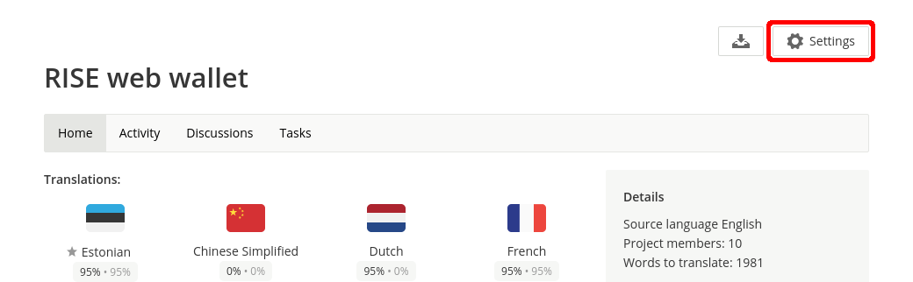
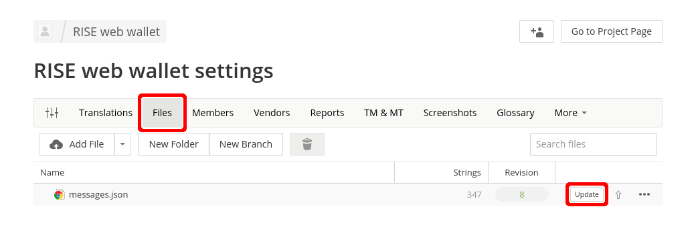
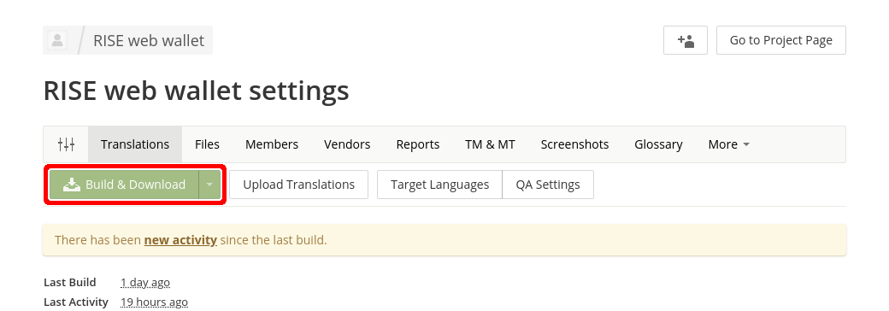

# Managing translations

RISE wallet uses Crowdin to crowdsource translations to different languages. The translation project URL is <https://crowdin.com/project/rise-web-wallet>.

## Exporting strings to Crowdin

```
$ yarn intl:prepare
$ yarn intl:export
```

This will generate _tmp/intl/messages.json_ file which needs to be uploaded to the Crowdin project via their web interface. To do that use the "Settings"  button on the Crowdin project overview page.



Then select the "Files" tab and press the "Update" button in _messages.json_ row. Then select the generated file and upload it. Afterwards Crowdin will give statistics on string additions and removals.



## Importing translated strings from Crowdin

Go to project settings on Crowdin. From there you want to use the "Build & Download" button to get a zip file with the latest translations for all languages.



After that you need to import them using the following commands:

```
$ yarn intl:prepare
$ yarn intl:import ~/Downloads/rise-web-wallet.zip
```

